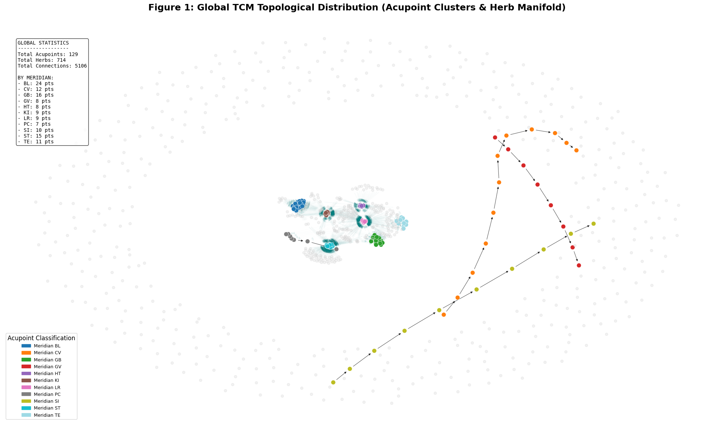
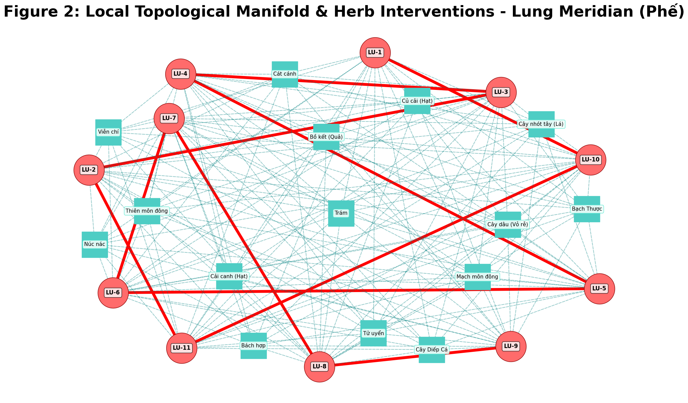
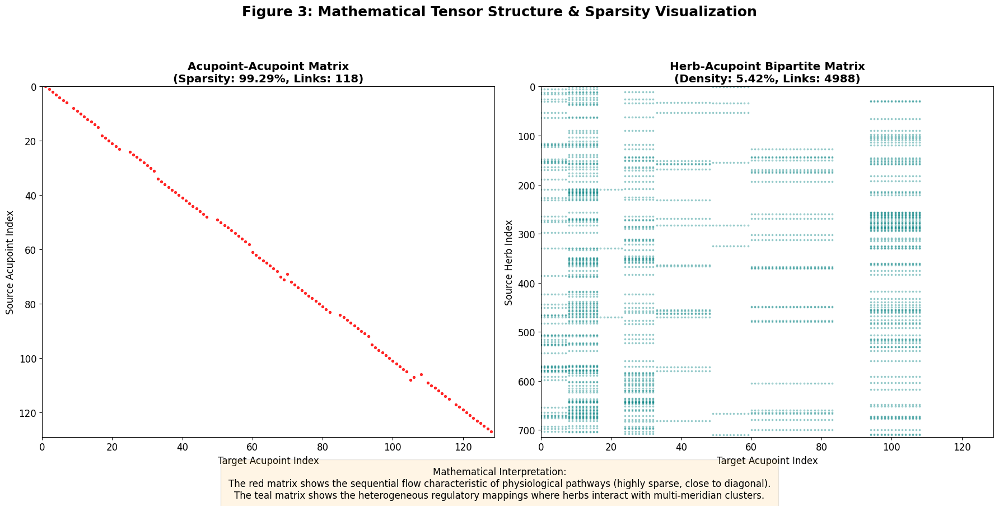

# TCM-TopoGraph: Heterogeneous Graph for TDA-AI Benchmark

## Overview
TCM-TopoGraph is a specialized framework designed to build and visualize a real-world heterogeneous graph for Traditional Chinese Medicine (TCM). This repository serves as a TDA-AI (Topological Data Analysis - Artificial Intelligence) benchmark, specifically tailored for PhD-level statistical analysis, node classifications, and topological explainability (XAI). 

The system maps the complex physiological flows and regulatory interactions between human meridians, acupoints, and biochemical herbs using PyTorch Geometric (PyG) and NetworkX.

---

## Dataset Characteristics
The real-world database constructs a heterogeneous graph utilizing two primary node types and bipartite interactions:
*   **Acupoint Nodes**: Represents 14 Meridians (scanned as 11 distinct clusters in the pipeline) and features multi-modal embeddings (Image + Text + Topo Coordinates).
*   **Herb Nodes**: Contains 714 distinct herbs with biochemical text embeddings.
*   **Flow Edges (Directed)**: Connects Acupoint to Acupoint to represent directed physiological flows along meridians.
*   **Tropism Edges (Heterogeneous)**: Connects Herb to Acupoint, mapping the regulatory meridian tropism (interactions) of external herbs.

---

## Repository Structure
While integrating with the main GitHub repository, ensure your environment contains the following structured files for the Colab notebook to execute successfully:

| File Name | Description | Required |
| :--- | :--- | :--- |
| `TCM14_Nodes_Base64.csv` | Contains the primary Acupoint node data, sequence orders, and Meridian classifications. | Yes |
| `Acupoints_With_Images.csv` | Contains atlas and image-based topological coordinates for the nodes. | Yes |
| `ViThuoc_final.csv` | Contains the database of 714 Herbs and their meridian tropism (Quy Kinh) mappings. | Yes |
| `TCM_HeteroGraph_Builder.ipynb` | The primary Google Colab notebook containing the pipeline execution. | Yes |

---

## Requirements
To run the framework locally or in a customized Jupyter/Colab environment, install the required frameworks:
*   `pandas`
*   `numpy`
*   `torch`
*   `torch_geometric`
*   `networkx`
*   `matplotlib`

---

## Getting Started (Google Colab Guide)

**Step 1: Open the Environment**
Launch the provided `.ipynb` file in Google Colab.

**Step 2: Upload the Database**
Before running the graph pipeline, you must upload the three core CSV files (`TCM14_Nodes_Base64.csv`, `Acupoints_With_Images.csv`, and `ViThuoc_final.csv`) directly into the root directory of your Google Colab instance. The script strictly checks for their existence and will throw a `FileNotFoundError` if they are missing.

**Step 3: Execute the Pipeline**
Run the main execution cell. The script will automatically process the data in four stages:
1.  **Loading Database**: Reads the provided CSV files into Pandas DataFrames.
2.  **Initializing Nodes**: Generates PyG random feature embeddings (`512` dimensions for Acupoints, `256` for Herbs) and maps node IDs.
3.  **Establishing Edges**: Builds the directed flow edges and heterogeneous tropism edges using PyTorch tensors.
4.  **Summary and Conversion**: Prints tensor statistics and converts the `HeteroData` object to a `NetworkX` DiGraph for explainable visualization.

---

## Explainable Visualizations (XAI)
The script automatically generates three publication-ready figures to explain the topological structure:

### Figure 1: Global Macro Topology
Visualizes the global TCM topological distribution. It maps out Acupoint clusters by their specific meridians (using a customized color map) surrounded by the broader "Herb Manifold." Black arrows denote internal physiological flows, while teal links show external herb modulation. Includes a global statistics sidebar.

### Figure 2: Local Topological Manifold (Micro Explainable)
An XAI subgraph focusing on a highly connected target Meridian pathway. It isolates specific Acupoint nodes and their directly connected Herb modulators, providing link-level statistics and detailed pathway explanations.

### Figure 3: Adjacency Matrix Sparsity
A mathematical tensor structure visualization comparing the Homogeneous and Bipartite graphs. 
*   **Acupoint-Acupoint Matrix**: Displays sequential physiological flows, resulting in a highly sparse matrix close to the diagonal.
*   **Herb-Acupoint Matrix**: Displays the bipartite regulatory mappings showing how herbs interact with multi-meridian clusters.

